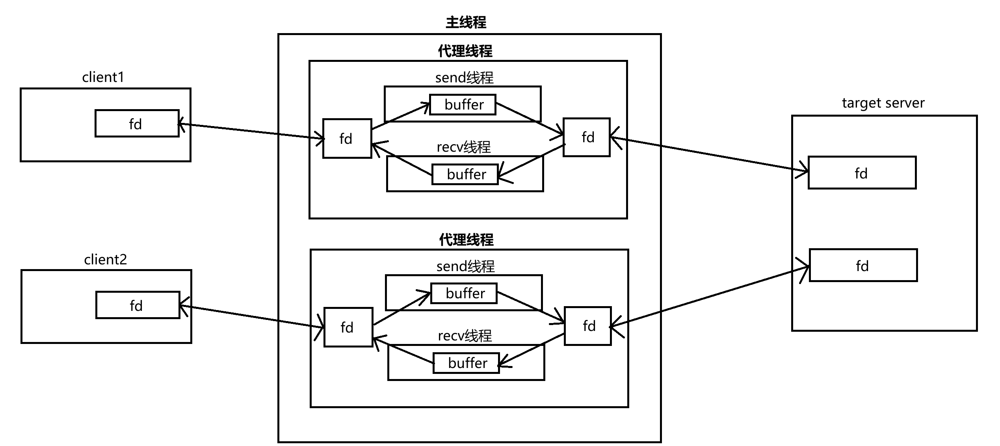
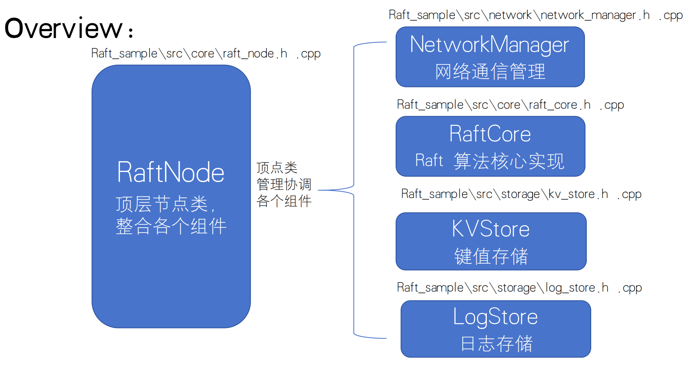
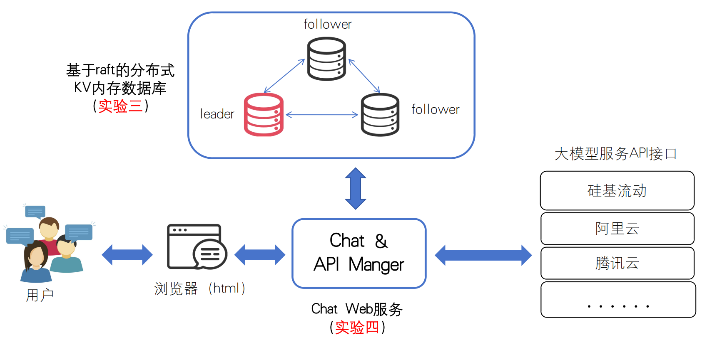
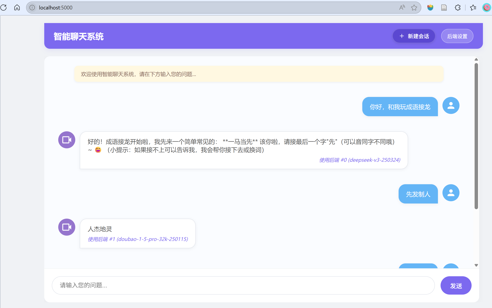
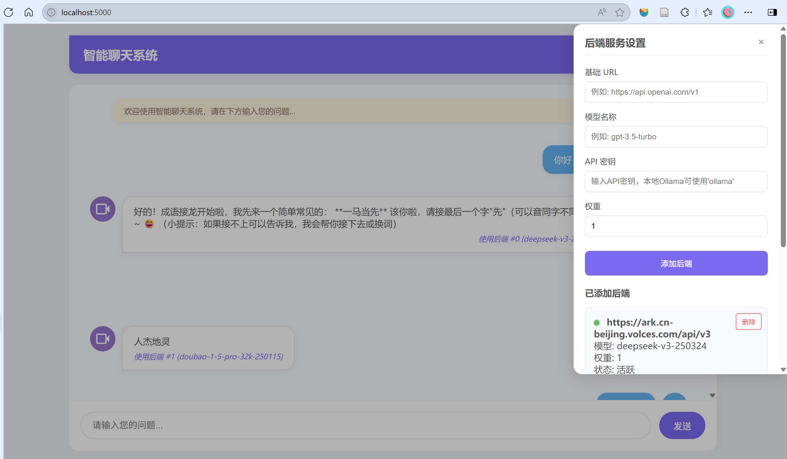

# 《云计算技术》课程实验

<!--**This is the repo containing all the lab materials for undergraduate course CS06142 "Cloud Computing Techniques" at Hunan University**--> 

## 简介

这是2025年湖南大学 专业选修课 CS06142《云计算技术》 云里雾里队 的实验仓库。

四次实验分别主要涉及并发编程、网络编程、Raft分布式一致性算法和前后端全栈开发能力。

最终云里雾里队完成所有实验并上台展示了Lab4，在该课程上获得了100分的成绩。

## Lab1：多线程解大量数独题

实验要求见[Lab1目录](https://github.com/fengzhuangxian/cloud-computing-labs/tree/master/Lab1)

这是一个经典的**生产者-消费者**问题，主要练习**并发编程**

关键设计：

- 使用**环形缓冲区**存储数独题
- 使用3个指针input_index,solve_index,output_index来标识环形缓冲区中新增未解题，已解题，输出题的位置，并以指针位置为条件处理生产者-消费者的同步问题（使用pthread互斥锁，条件变量）
- 使用3个线程分别专门处理输入文件、读取文件中的数独题、输出已解的数独题
- 负责解题的多个工作线程，采用**线程池**方案

## Lab2：高性能 HTTP Server 及 Proxy Server

实验要求见[Lab2目录](https://github.com/fengzhuangxian/cloud-computing-labs/tree/master/Lab2)

该实验主要涉及**网络编程**和**并发编程**

**高性能 HTTP Server**关键设计：

- 使用**线程池**处理客户端请求

- 多线程**阻塞式**server：所有线程共享同一个监听socket，通过`accept`竞争处理新连接

- **支持HTTP流水线**：通过查找`\r\n\r\n`区分不同请求，循环处理一个TCP连接中的多个请求

  

**Proxy Server**关键设计：

- **核心架构**：
- - 主线程：监听客户端连接，为每个连接创建代理线程
  - 代理线程：建立其到目标服务器的连接，并创建两个子线程
  - 代理线程的两个子线程：分别转发客户端到服务端和服务端到客户端的数据，转发的方式为复制套接字文件描述符中的内容
  - 连接和转发关系如图：
- **并发连接数控制**：主线程通过互斥锁（Monitor形式）保护全局计数器`concurrentThreadNum`，限制最大并发连接数为100。这样做是为了**避免服务器挂掉**，否则在连接请求过多时会由于操作系统限制其打开的文件描述符数量而挂掉
- **数据完整保证**：`sendAllChunk` 和 `recvAllChunk` 两个函数分别进一步封装socket库中的`send`和`read`函数，确保完整发送和接收缓冲区的数据

## Lab3：基于Raft协议的分布式KV数据库

实验要求见[Lab3目录](https://github.com/fengzhuangxian/cloud-computing-labs/tree/master/Lab3)

**目标**：实现一个基于 Raft 共识算法的分布式内存键值数据库（KV 存储）。该系统将能够处理客户端的请求，在多个服务器节点之间保持数据一致性，同时能够应对节点故障

该实验采用**C++**开发，主要涉及**Raft共识算法的实现**，网络编程，并发编程。

核心架构如下：

关键设计：

- 实验需要完成的是raft算法中**领导人选举**和**日志同步**的4个消息处理函数(投票请求，投票响应，日志同步请求，日志同步响应），这里我主要参考[raft算法官方网页]([Raft Consensus Algorithm](https://raft.github.io/))中的模拟器和[raft论文](https://raft.github.io/raft.pdf)
- 该数据库的KV存储使用的是C++ STL中的`unordered_map`类，原本并未实现持久化，我们在此基础上使用**快照**的方法将数据以文件的形式保存

## Lab4：LLM聊天服务系统

实验要求见[Lab4目录](https://github.com/fengzhuangxian/cloud-computing-labs/tree/master/Lab4)

**目标**：结合Lab3所写的KV数据库，开发一个基于Web的聊天系统，能够连接并管理多个大型语言模型(LLM)后端，提供统一的用户聊天界面。系统应支持负载均衡和故障转移，确保服务的高可用性和稳定性

该实验前端基于HTML/CSS/JavaScript的响应式Web界面，后端是基于Python的Flask框架开发的Web服务，数据库采用Lab3实现的分布式KV数据库，锻炼**前后端全栈开发能力**

我们组的关键设计：

- 历史聊天记录加载

- 新建会话功能

- 基于加权随机算法的后端大模型API选择策略

- API-key的加密存储

  

实现效果如图：

最终该系统和数据库在个人电脑上部署，在展示期间开放给校园网内其他用户使用，运行状况良好

## 其他

本实验Lab1，Lab2，Lab3由我个人完成，Lab4由和ll同学合作完成，合作流程遵循git工作流，具体贡献/提交可在提交记录中查看
